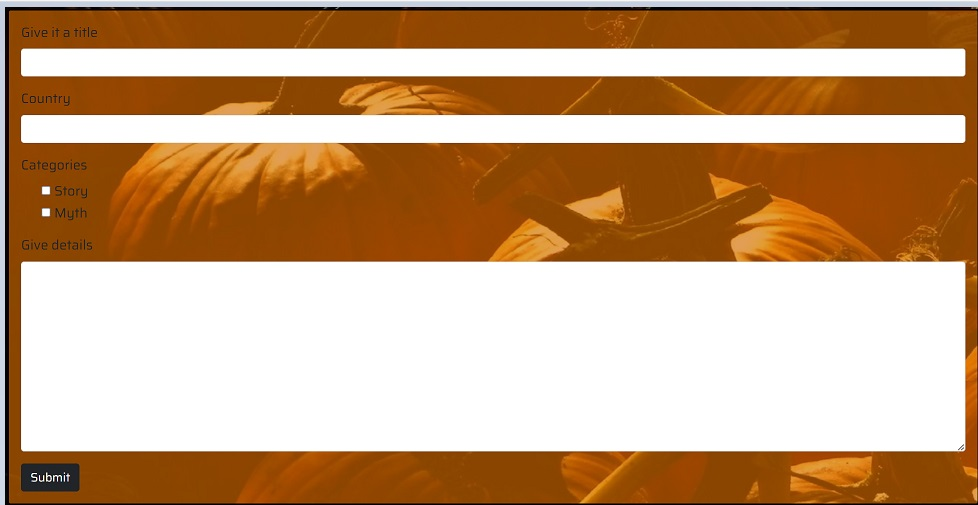
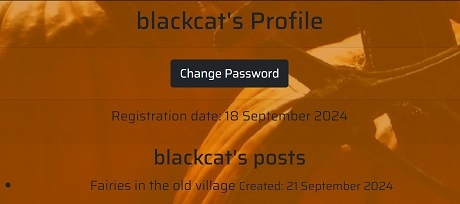
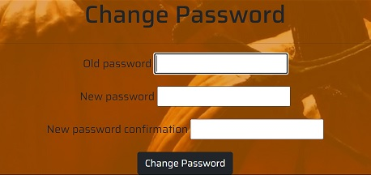

<h1 align="center">SCARY PUMPKIN" </h1>

[Click here to check live project](https://p4-pumpkin-98475df7c050.herokuapp.com/)

 Welcome to Scary Pumpkin! Simple and intuitive blog site where users can register, log in, and share eerie stories, myths, and folklore. Our platform is designed with a focus on delivering a seamless experience to help users enjoy and contribute to our collection of chilling tales without distractions.

## Index – Table of Contents
* [User Experience (UX)](#user-experience-ux) 
* [Features](#features)
* [Design](#design)
* [Used Languages, Programmes and Sites](#used-languages-programmes-and-sites)
* [Testing](#testing)
* [Deployment](#deployment)
* [Credits](#credits)
  
## User Experience (UX)

## 3.1. The Strategy Plane

### 3.1.1 The Idea
Scary Pumpkin is an interactive platform where users can share, read, and comment on scary stories. Users can create, edit, and delete their own stories, as well as comment on other users' stories.

### 3.1.2 The Ideal User
The target audience is individuals who enjoy reading and writing scary stories and local myths, are interested in creative writing, and enjoy community interaction.

- The ideal user loves horror and suspense stories
- The ideal user enjoys writing and sharing their own stories and mythes
- The ideal user enjoys reading stories from other writers
- The ideal user enjoys commenting on stories and getting feedback
- The ideal user wants to improve their horror lores

### 3.1.3 Site Goals
- Allow users to share their stories and mythes from their land
- Provide users with the opportunity to read and comment on other stories
- Give users the ability to edit and delete their stories
- Create an inspiring community for creative writers
- Encourage original content production in the horror and suspense genre
- Increase interaction among users with comment and develop a culture of feedback

-   ### User stories

  # Classification of User Stories

## Could Have
These are the features that would be nice to have, would make the site looks more modern.

- Vote
- Profile Picture

## Must Have
These are necessary features to have in blog-story sharing site.

- Register 
- Login
- Display list
- Filter
- Create post 
- Edit post
- Delete post
- Comment
- Account page
- Change password
- Documentation

**Users stories**

[All Users Stories ](https://github.com/aksurcos/pumpkin/issues?q=is%3Aissue+is%3Aclosed)

## Features

### Existing Features

-   __User Registration and Login__

    -  Users can create accounts and securely log in to access their personal profile and post stories.
Post Stories & Myths: Share your favorite spooky stories, urban legends, or mysterious myths with the community..

-   __Post Stories & Myths__

    - Share your favorite spooky stories, urban legends, or mysterious myths with the community.

   
-   __Edit & Delete__

    - Edit or delete anytime your posts.

-   __Comment__

    - Commenting is available below posts.

 
-   __Account Page__

    - Available to see old posts.

 
-   __Changing Password__

    - Easy to change password.

-   __Filter Post List__

    - Filter if you want specific category.

 
-   __Messages__

    - Error or success messages are displayed.

 
-   __Navbar & Footer__

    - Easy to route in site.

    

## Design

-   ### General Design
    - The portal has nostalgic basic looking with some pumpkins.

-   ### Color Set
    -  Color palette is chosen as orange and black to reflect Halloween's spirit.
       
-   ### Font-Type
    -   It is imported from Google Fonts. It has compatible simple looking to make reading easy.
    

## Used Languages, Programmes and Sites

-   HTML5
-   CSS3
-   Python
-   JavaScript
-   Bootstrap
-   Git
-   GitHub
-   Gitpod
-   Django
-   PostgreSQL
-   Heroku
-   Font Awesome
-   Pexels.com
-   ChatGPT(To generate posted stories and myths)

-   __DATABASE SCHEMA__

## Testing

### Validator Testing and Lighthose

- Lighthouse

- [HTML Validator](https://validator.w3.org/)

| Directory	  | File	 |State| Result|
| ------------- | ------------- | ------------- | ------------- |
|Index  | index.html  | Not Applicable  | PASS | 
| Register  | register.html  | Not Applicable  | PASS |
| Login | login.html  | Not Applicable  | PASS |
| Account Page  | account.html |Only Logged in  | PASS  |
| Change Password | change-password.html  |Only Logged in  | PASS |
| Post List | story.html | Not Applicable| PASS |
| Filtered Post List | story-list.html |  Not Applicable | PASS |
| Post Details| story-details.html |Only Logged in| PASS |
| Create | story-create.html | Only Logged in| PASS |
| Edit | edit.html |Only Logged in| PASS |
| Delete  | delete-confirm.html  |Only Logged in| PASS |

- [CSS Validator](https://jigsaw.w3.org/css-validator/)

    - result for base.css
      

- [Python Validator](https://pep8ci.herokuapp.com/#/)

    - result
    
    3 pages have long line character errors.

### User Stories & Features Testing

## Register
- Tested that a user can successfully register with valid information
- Verified that appropriate error messages are displayed for invalid inputs
- Ensure that the newly registered user can log in with their credentials

## Login
- Confirmed that a registered user can log in with correct credentials
- Verified that appropriate error messages are shown for incorrect username or password

## Display List
- Checked that the paginated list of posts is displayed correctly
- Verified that pagination works as expected
- Ensured that post details (title, author, date etc.) are displayed accurately

## Filter
- Tested that users can filter posts by category
- Verified that multiple category selections work correctly
- Ensured that the filtered results are accurate and update in real-time

## Create Post
- Confirmed that authenticated users can access the create post page
- Tested that all form fields (title, content, category) work correctly
- Verified that appropriate error messages are shown for invalid inputs
- Ensured that the post is successfully created and appears in the list

## Edit Post
- Checked that only the author of a post can access the edit functionality
- Test that all form fields are pre-populated with existing post data
- Verified that changes are saved correctly and reflected in the post list
- Ensured that appropriate error messages are shown for invalid edits

## Delete Post
- Confirmed that only the author of a post can delete it
- Tested the delete confirmation process
- Verified that the post is removed from the list after deletion
- Ensured that associated comments are also deleted

## Comment
- Tested that authenticated users can add comments to posts
- Verified that comments are displayed correctly under the respective posts
- Ensure that comments are associated with the correct post

## Account Page
- Confirmed that users can access their own account page
- Verified that user information is displayed correctly
- Ensured that the user's post history is accurately displayed

## Change Password
- Checked that users can access the change password functionality
- Tested that the current password is required before allowing changes
- Ensured that the password is successfully updated and the user can log in with the new password

## Documentation
- Verified that the documentation is comprehensive and up-to-date
- Tested any code examples or instructions provided in the documentation
- Ensured that the documentation covers all major features and functionalities
- Checked for clarity and readability of the documentation

### Viewport Testing
Task : To test responsiveness on different devices with different view-port.
What to expect : Project does response well on all devices.
Result : No content is distorted on different view-port.

### Compatibility Testing
Task : To test functionality in different browsers.
Method : All test cases listed above were tested in following applications:
Google Chrome
Mozilla Firefox
Microsoft Edge
Opera
Safari
What to expect: Project does its function in all web browsers.
Result : Project remains its functionality.

### test.py

## Deployment

### Deployment steps

- Log in to your account at heroku.com if you don't have any, create one.
- Click on create a new app, give an matchless app name and then choose your region
- Connect Heroku app to your Github account and write the repository name, click 'Search' and then 'Connect'
- Click on your app and then go to the "Settings" tab.
- Scroll down to the "config vars" section and enter the following:
   - `DATABASE_URL`: set this
   - `SECRET_KEY`: 1
   - `CLOUDINARY_URL`: Set your Cloudinary URL.
   - `Port`: set to 8000.
- Go to "Deploy" tab and go down to the "Deployment method" section and select GitHub and then sign into your account.
- Below that in the "search for a repository to connect to" search box enter your repository's name.
- Once it has been connected scroll down to the "Manual Deploy" and click "Deploy branch".
- "View App" button will be below.

You'll also need these two files when deploying to Heroku.
- `requirements.txt`
- `Procfile`

To create "requirements.txt"
- pip3 install -r requirements.txt

To update"requirements.txt"
- pip3 freeze --local > requirements.txt
  
To create "Procfile"
 - echo web: gunicorn app_name.wsgi > Procfile

Replace `app_name` with the folder's name of `settings.py`

    
## Credits

### Icons
- [Font Awesome](https://fontawesome.com/)

### Codes   
- Code Institute Ready Template
- The previous projects' README.md
  

### Inspration and Thanking
- Thank you to all helpful Slack Code Institute Community that I've especially got help to prepare "README.md"
